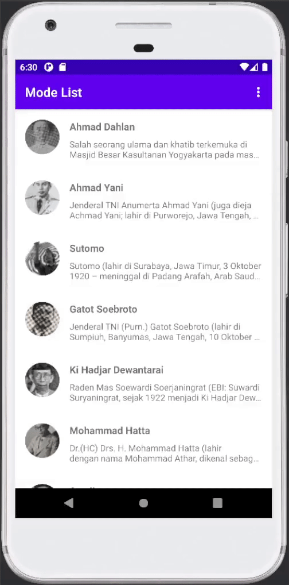

# RecyclerView
Android Kotlin Test Project - Recycler View

> **Update 1 - List Layout**  
> 
> 

> **Update 2 - Grid Layout** 
> 
> 

> **Update 3 - Card Layout** 
> 
> 

> **Update 4 - Item OnClickListener** 
> 
> 
